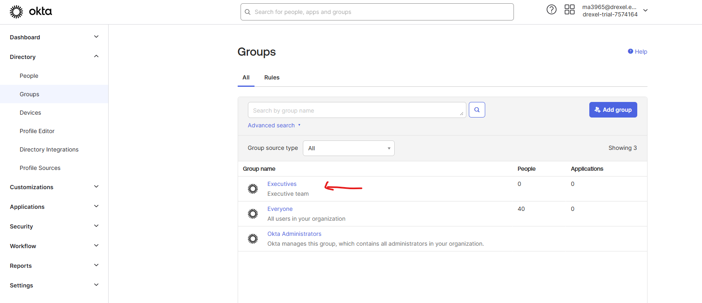
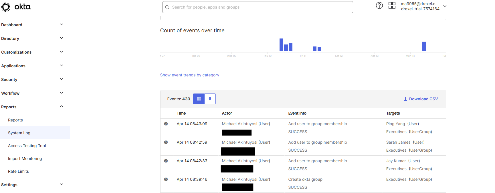
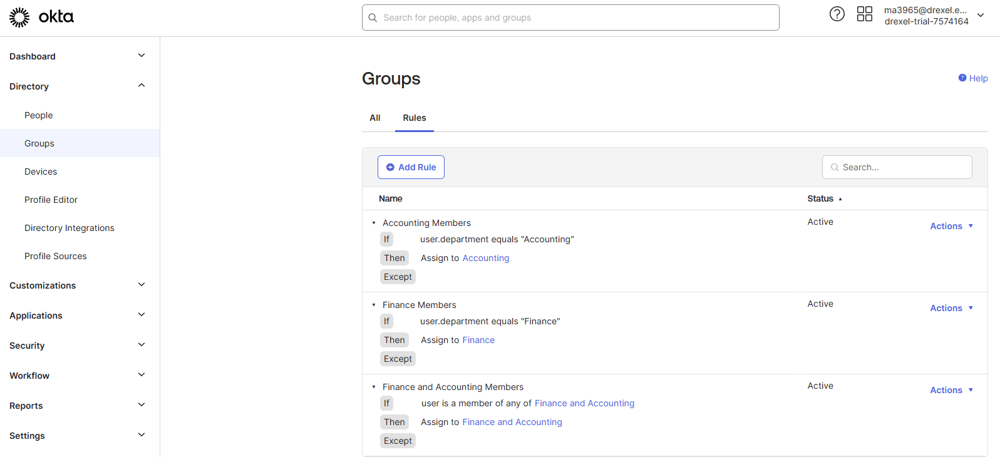
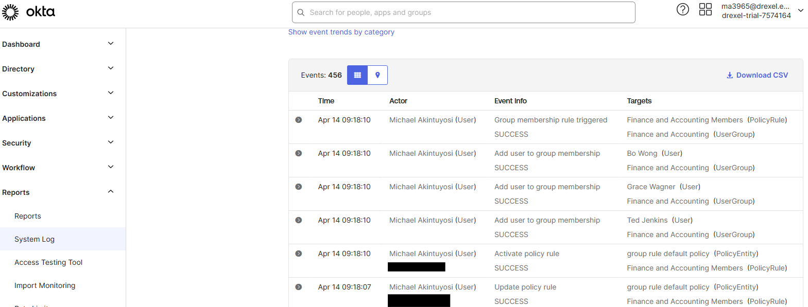

# 👥 Organizing Users with Groups in Okta

This lab demonstrates how to manage user access efficiently in Okta using **groups**, **group rules**, and **Okta Expression Language**. It simulates real-world scenarios where users are assigned to groups manually or dynamically based on attributes such as department or user type.

---

## 🎯 Lab Objectives

- Create and manage user groups in Okta
- Manually assign users to groups
- Use basic rules and expressions to automate group membership
- Verify group activity using Okta system logs

---

## 🔹 Lab 1: Manually Assign Users to a Group

**Scenario**: You need to create a group for Executives and manually assign members.

**Steps**:
1. Create a group called `Executives`
2. Add these users manually:
   - Jay Kumar
   - Sarah James
   - Ping Yang
3. Verify group membership and check the logs

📸 Screenshot:  


📸 Screenshot:  


---

## 🔹 Lab 2: Use Rules to Assign Users to Groups

**Scenario**: Create dynamic groups based on department.

**Groups**:
- Finance
- Accounting
- Finance and Accounting

**Rules Added**:
- Finance Members → if `department == Finance`
- Accounting Members → if `department == Accounting`
- Finance and Accounting Members → if user is in either group

📸 Screenshot:  


📸 Screenshot:  


---

## 🔹 Lab 3: Use Okta Expression Language in a Group Rule

**Scenario**: Assign only employees (not contractors) from Finance or Accounting to a special group.

**Group**:  
- `Finance and Accounting – Employees Only`

**Expression Used**:
```text
(user.department=="Finance" || user.department=="Accounting") && user.userType=="Employee"
